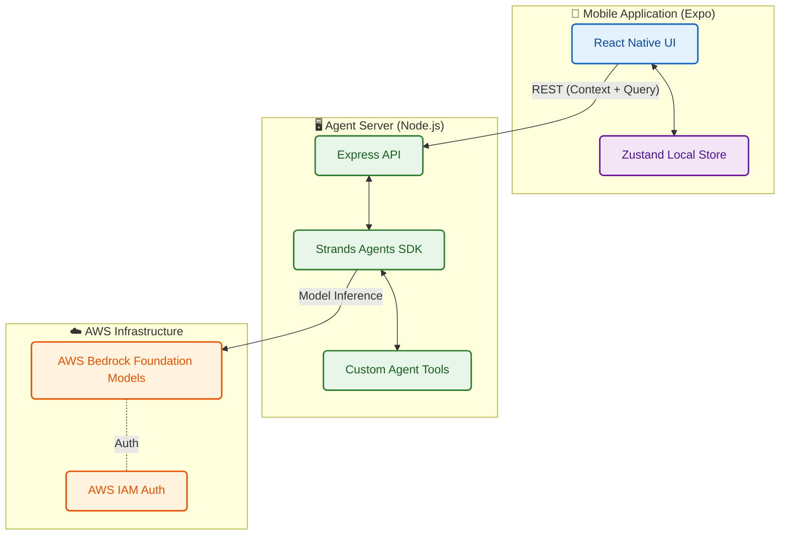

<div align="center">


# CampusIQ 🎓

### The ultimate intelligent campus companion — manage academics, track attendance, and chat with your personalized AI assistant.

[](https://reactnative.dev)
[](https://expo.dev)
[](https://nodejs.org)
[](https://aws.amazon.com/bedrock/)
[](https://github.com/awslabs/strands-agents)
[](https://www.typescriptlang.org/)
[](LICENSE)

</div>

---

## 📖 Overview

**CampusIQ** is a comprehensive, AI-powered academic management platform designed to streamline the modern student experience. By centralizing timetable scheduling, attendance tracking, SGPA forecasting, and assignment management, CampusIQ eliminates the friction of university life. 

What truly sets CampusIQ apart is its **Local AI Agent**, built entirely on the open-source AWS Strands Agents SDK and powered by AWS Bedrock. This context-aware assistant securely reads your local academic data to answer questions like *"How many classes can I skip today?"* or *"What is my predicted SGPA if I score an A in Physics?"* — providing instant, personalized insights.

---

## ❓ Why CampusIQ?

University life is chaotic. Students are forced to juggle multiple portals, spreadsheets, and messaging apps just to keep track of their classes, attendance requirements, and impending deadlines. 

We built CampusIQ to solve this fragmentation. It's not just another calendar app; it's a proactive assistant that knows your schedule better than you do. It warns you before your attendance drops below the required threshold, helps you strategize your grades for the semester, and uses Generative AI to answer hyper-specific questions about your academic standing.

---

## 🎥 Video Demo

<div align="center">
  <video src="[INSERT_DEMO_VIDEO_LINK_HERE]" controls="controls" style="max-width: 100%; height: auto;"></video>
  <p><em>(Replace with your 3-minute hackathon demo video link)</em></p>
</div>

---

## ✨ Key Features In-Depth

### 🤖 Context-Aware AI Assistant
Ask natural language questions about your schedule, attendance, and grades. Powered by AWS Bedrock and the Strands SDK, our agent understands the nuances of university life and gives actionable advice based on your real-time data.

### 📊 Smart Attendance Tracking
Log your presence in classes with a single tap. The app calculates your current percentage dynamically and tells you exactly how many classes you can afford to miss without falling below the mandatory limit (e.g., 75%).

### 📅 Dynamic Timetable
An interactive, beautiful calendar view allows you to track upcoming lectures, labs, and extra classes. It handles bi-weekly schedules and one-off events seamlessly.

### 📈 SGPA Forecaster
Play with a "What-If" grading wizard. Adjust your expected grades on an intuitive glass-slider to predict your semester SGPA. Understand exactly what grades you need in upcoming finals to achieve your target GPA.

### 📝 Assignment & Exam Manager
Never miss a deadline. Track pending assignments, project due dates, and upcoming midterms or finals. Prioritize tasks visually with color-coded tags.

### 🎨 Premium UI/UX
Enjoy stunning glassmorphism design, smooth micro-animations powered by Reanimated and Moti, rich haptic feedback, and a fully customizable subject color palette that makes the app a joy to use.

### 🔒 Local-First Privacy
Your academic data belongs to you. It stays on your device using encrypted local storage (Zustand + AsyncStorage). The AI only accesses the context needed for your specific query.

---

## 🧠 Agent Capabilities

Our AI Assistant is designed to be your personalized academic advisor. Here are some examples of what you can ask it:

- **Attendance Queries:** 
  - *"I missed Math today. What's my new attendance percentage?"*
  - *"How many more Physics classes can I bunk before I drop below 75%?"*
- **Schedule Inquiries:**
  - *"What classes do I have tomorrow morning?"*
  - *"Do I have any labs scheduled for Friday?"*
- **Grade Strategy:**
  - *"If I get a 'B' in Chemistry and an 'A' in Math, what will my SGPA be this semester?"*
  - *"What grades do I need to maintain an overall SGPA of 8.5?"*

The agent uses a ReAct (Reasoning and Acting) framework, utilizing custom tools to query your local state, calculate projections, and return a comprehensive answer.

---

## 🛠️ Tech Stack

### Frontend (Mobile App)
- **React Native (Expo)**: Cross-platform mobile framework for iOS/Android.
- **TypeScript**: Ensuring type safety across the entire application.
- **Zustand**: Fast, scalable, and lightweight reactive state management.
- **Expo Router**: File-based routing for seamless navigation.
- **Reanimated & Moti**: For fluid, 60fps animations and gesture handling.
- **AsyncStorage**: Persistent local data storage.

### Backend (Agent Server)
- **Node.js + Express**: High-performance API server.
- **AWS Bedrock SDK**: Access to powerful Foundation Models for AI inference.
- **Strands Agents SDK**: Agentic orchestration, tool binding, and multi-turn reasoning workflows.
- **Zod**: Runtime schema validation to ensure robust AI inputs and outputs.
- **dotenv**: Secure environment variable management.

---

## 🏗️ System Architecture



---

## 🚀 Getting Started

Follow these steps to get CampusIQ running on your local machine.

### Prerequisites
- [Node.js](https://nodejs.org/) (v20 or higher)
- [Expo CLI](https://docs.expo.dev/get-started/installation/)
- An AWS Account with access to Bedrock Foundation Models (e.g., Claude 3, Llama 3)
- iOS Simulator (Mac) or Android Studio Emulator

### 1. Clone the repository
```bash
git clone https://github.com/priyanshusharan-cmd/campusiq.git
cd campusiq
```

### 2. Start the Agent Server (Backend)
The backend handles the AI orchestration via AWS Bedrock and the Strands SDK.
```bash
cd agent-server
npm install

# Create your .env file
cp .env.example .env

# Add your AWS credentials and region to the .env file
# Ensure your IAM user has bedrock:InvokeModel permissions
npm run dev
```

### 3. Start the Mobile App (Frontend)
Open a new terminal window at the project root to start the React Native application.
```bash
# From the root directory (campusiq)
npm install
npx expo start
```
Scan the QR code with the Expo Go app on your physical device (iOS/Android), or press `i` to launch it in the iOS Simulator.

---

## 🏆 Hackathon Submission Details (AWS First Commit)

We built CampusIQ specifically for the AWS First Commit Hackathon, addressing real-world problems faced by students globally.

- **Track:** Build It (Agents and AI)
- **Problem Solved:** Fragmented student data leading to missed classes, chaotic deadlines, and unpredictable grades. CampusIQ centralizes this into a single, intelligent interface.
- **AWS Usage:** 
  - **AWS Open Source:** Leveraged the **Strands Agents SDK** to orchestrate our AI assistant efficiently.
  - **AWS Cloud:** Utilized **AWS Bedrock** to securely access powerful Foundation Models for the agent's reasoning engine, completely bypassing traditional, less-secure third-party APIs.

---

## 🛣️ Roadmap

We have big plans for CampusIQ post-hackathon:
- [ ] **Cloud Sync:** Optional AWS DynamoDB integration to back up data across multiple devices.
- [ ] **Push Notifications:** Reminders for upcoming classes and assignment deadlines using AWS SNS.
- [ ] **Multi-University Support:** Pre-loaded grading schemas for different global universities.
- [ ] **More Agent Tools:** Allowing the agent to directly add tasks to your calendar or schedule study sessions.

---

## 🤝 Contributing

We welcome contributions! If you have suggestions for improvements or bug fixes:
1. Fork the repository
2. Create your feature branch (`git checkout -b feature/AmazingFeature`)
3. Commit your changes (`git commit -m 'Add some AmazingFeature'`)
4. Push to the branch (`git push origin feature/AmazingFeature`)
5. Open a Pull Request

---

## 📄 License

This project is licensed under the MIT License - see the [LICENSE](LICENSE) file for details.

---

<div align="center">
  <sub>Built with ❤️ for the AWS First Commit Hackathon.</sub>
</div>
